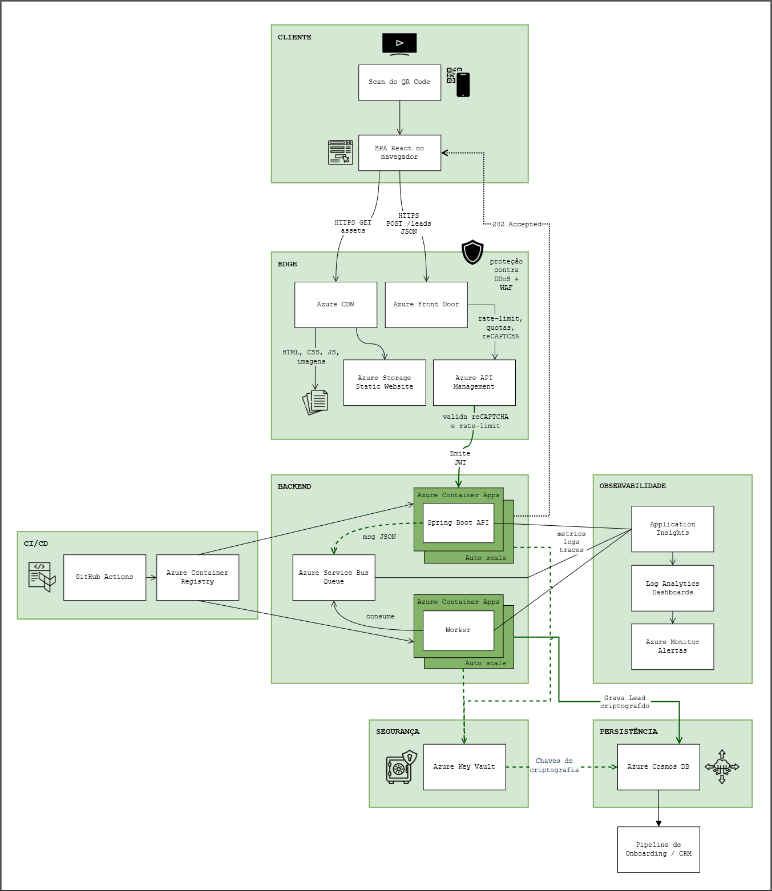

<samp>
<h1 align="center"> DESAFIO SYSTEM DESIGN </h1>

## INTRODUÇÃO

Este projeto foi desenvolvido como parte de processo seletivo e consiste em proposta de arquitetura capaz de processar milhões de cadastros gerados através de campanha de marketing para atração de clientes para captura de leads. Os dados coletados alimentarão uma pipeline de onboarding.

A solução tem como objetivo garantir:

- **Escalabilidade**  
  Ajuste automatizado de recursos para suportar picos de acesso sem intervenção manual.

- **Alta disponibilidade**  
  Solução redundante e com fail-over entre regiões para manter o serviço sempre online.

- **Segurança e conformidade (LGPD)**  
  Proteção de dados com criptografia in-transit e at-rest, além de controle de acesso e auditoria completa.

- **Performance**  
  Tempo de resposta otimizado em todas as camadas da aplicação.

---

## 1. ARQUITETURA DO SISTEMA

A arquitetura é baseada em microsserviços desacoplados por mensageria. O front-end em React chama as APIs através de um **balanceador de borda global** – por exemplo, Azure Front Door –, que encaminha as requisições para um **gateway de API gerenciado** – como Azure API Management ou AWS API Gateway – responsável por quotas e rate-limit. 

Os serviços de back-end, escritos em Java /Spring Boot, são empacotados em containers e executados em uma **plataforma serverless de containers com auto-scale** (Azure Container Apps ou AWS App Runner / ECS Fargate). A ingestão é desacoplada da camada de *persistence* por meio de uma **fila em serviço de mensageria totalmente gerenciado** (Azure Service Bus ou Amazon SQS/SNS). 

Os leads são armazenados em um **banco NoSQL com criptografia, escalabilidade horizontal e fail-over** (Azure Cosmos DB ou Amazon DynamoDB), enquanto logs, metrics e traces convergem para uma **solução de monitoramento gerenciada** (Azure Application Insights / Azure Monitor ou Amazon CloudWatch / X-Ray), garantindo observabilidade unificada.

---

### Diagrama de arquitetura



---

### Fluxo de dados - do QR Code até o banco de dados

| #    | Etapas do Fluxo | Validações executadas | Tecnologias que atuam |
|------|----------------|-----------------------|-----------------------|
| *0*  | **Leitura do QR Code** <br> A câmera do celular interpreta o QR e abre a URL de pré-cadastro | - | - |
| *1*  | **Entrega do site** <br> O navegador requisita os static assets, que são servidos a partir do PoP de maior proximidade | - | Azure CDN · Azure Storage Static Website |
| *2*  | **Renderização do form** | • Validação dos campos com React <br> • Geração de token reCAPTCHA | React · reCAPTCHA |
| *3*  | **Envio do cadastro** <br> Body JSON com nome, CPF, telefone, e-mail | • Token reCAPTCHA no header | - |
| *4*  | **Proteção de borda** | • WAF aplica regras OWASP Top 10 <br> • Azure DDoS Protection reduz tráfego mal-intencionado | Azure Front Door · WAF · DDoS Standard |
| *5*  | **API Gateway recebe request** | • Verifica token reCAPTCHA via API <br> • JSON Schema valida tipos/tamanho <br> • Limita requisições através de rate-limit e quota <br> • Emite *JWT interno* | Azure API Management |
| *6*  | **Microsserviço `lead-intake` processa request** | • Spring Security valida JWT <br> • Bean Validation nos DTOs <br> • Gera `cpfHash = SHA-256(cpf)` (deduplicação) <br> • Criptografia de CPF e telefone | Java · Spring Boot · Spring WebFlux · Spring Security |
| *7*  | **Mensagem é publicada na fila para processamento assíncrono** | • Até 3 novas tentativas se falhar <br> | Azure Service Bus |
| *8*  | **Resposta ao cliente** | - | HTTP 202 Accepted (“Cadastro recebido!”) |
| *9*  | **Worker `lead-persister` consome a fila** | • Se `cpfHash` já existir, ignora a mensagem <br> • Após gravar o lead com sucesso, envia email ou SMS de confirmação ao cliente | Java · Spring Boot · Service Bus SDK |
| *10* | **Gravação no banco de dados** | • Autoscale ajusta throughput automaticamente <br> • `Policy “Unique Key(cpfHash)”` impede duplicatas no banco de dados | Azure Cosmos DB |

---

## 2. DETALHAMENTO TÉCNICO

### 2.1 FRONT-END

- [x] **Tecnologia:** <br> Single-page application · React

- [x] **Hospedagem:** <br> Azure Storage Static Website · Azure Front Door · Azure CDN.

#### JUSTIFICATIVA

##### Single-page application (SPA)

Aplicações Single-Page (SPA) são projetadas para carregar apenas um HTML inicial e, então, atualizam dinamicamente o conteúdo via JavaScript, resultando em uma navegação mais fluida, sem a necessidade de recarregamentos completos da pág. Isso reduz o tempo até a primeira interação, proporcionando excelente UX.

##### React

Além de oferecer grande disponibilidade de bibliotecas (que poderão ser empregadas no forms e validação de dados), por ser um framework com comunidade e ecossistema consolidados, amplamente adotado em ambientes corporativos, o React poderá ser uma excelente opção.

##### Azure Storage Static Website

Azure Storage Static Website habilita a hospedagem de arquivos HTML, CSS e JS diretamente do Storage Account – serviço de armazenamento de objetos da Azure, similar ao Amazon S3 na AWS. É uma solução totalmente gerenciada e de baixo custo (cobrando apenas por armazenamento e tráfego de saída), sem necessidade de servidores. Escala automaticamente conforme o volume de acessos e permite deploy simples via CLI, pipeline CI/CD ou Azure Portal. Integra-se facilmente com serviços de CDN.

##### Azure Front Door

Serviço de entrega de aplicações global, atuando como balanceador de carga HTTP/HTTPS na borda, é capaz de rotear clientes ao PoP (Point of Presence) de maior proximidade (low-latency), garantindo alta disponibilidade. Azure Front Door também oferece Transport Layer Security (TLS) e Web Application Firewall (WAF) integrado para proteção na camada de aplicação contra ataques DDoS e OWASP Top 10.

##### Azure Content Delivery Network (CDN)

Acelera a entrega de *static assets* (HTML, CSS, JS e imagens) ao armazená-los em cache em diversos PoPs (Points of Presence) ao redor do mundo. Isso reduz significativamente o tempo de download para o cliente final ao servir os recursos a partir de locais com mais proximidade. Além de melhorar a performance, também alivia a carga na origem ao minimizar requisições diretas ao Azure Storage Static Website.

---

### 2.2 BACK-END

- [x] **Linguagem:** <br> Java 21 (LTS)

- [x] **Framework:** <br> Spring Boot 3 · Spring WebFlux

- [x] **Segurança:** <br> Spring Security Resource Server · JWT assinado pelo Azure API Management

- [x] **Validação:** <br> Bean Validation

- [x] **Resiliência:** <br> Resilience4j

- [x] **Gerenciamento de dependencies & Build:** <br> Maven · Docker

#### JUSTIFICATIVA

##### Java 21 (LTS)

Versão que oferece suporte oficial estendido, garantindo estabilidade a longo prazo, atualizações de segurança contínuas e ganhos de performance internos sem exigir migração de versão no meio do ciclo do produto.

##### Spring Boot 3 · Spring WebFlux

Framework moderno e consolidado para construção de APIs. O Spring WebFlux adota um modelo em que as operações de I/O são assíncronas (não esperam pela resposta antes de seguir o fluxo) e não-bloqueantes (não ocupam threads enquanto aguardam), permitindo que poucos threads atendam centenas de conexões simultaneamente. Isso reduz o consumo de recursos, sendo ideal para casos com picos abruptos de acesso.

##### Spring Security Resource Server · JWT

O Azure API Management, gateway de borda selecionado para a arquitetura da solução [ver seção 2.4], gera um JWT de curta duração para cada chamada que passou pelo Web Application Firewall (WAF). Esse token viaja internamente e é validado pelo Spring Security Resource Server no microsserviço. Dessa forma, o backend só aceita requisições que realmente vieram pelo gateway, mantendo rastreabilidade.

##### Bean Validation

Validação de dados estruturada em DTOs, via Bean Validation com anotações como `@NotBlank`, `@Pattern`, `@Email` e `@Size`. Integra-se automaticamente com Spring WebFlux e reduz verificação manual.

##### Resilience4j

Aplica circuit-breaker, retry, timeout e bulkhead às chamadas externas (Azure Cosmos DB [seção 2.3] e Azure Service Bus [seção 2.4]), permitindo falha rapidamente em caso de indisponibilidade, retries automatizados em caso de erros momentâneos, isolamento de recursos com instabilidade e limitação de concurrency. Dessa forma, evita cascata de erros, reduz latency em situações de queda e eleva a disponibilidade geral do back-end sem exigir infraestrutura adicional.

##### Maven · Docker

Maven centraliza o controle de versões no `pom.xml` e oferece plugins maduros. Docker empacota a aplicação em uma imagem imutável e reproduzível, que se integra nativamente à pipeline GitHub Actions para publicar no Azure Container Registry e implantar no Azure Container Apps [ver seção 2.4].

---

#### Estrutura da API

A API poderá ser estruturada com base na combinação de arquitetura em camadas e **Domain-Driven Design (DDD)**, com o objetivo de manter as regras de negócio isoladas da infraestrutura (como banco, filas, frameworks), promovendo baixo acoplamento, alta testabilidade, evolução segura com substituição de tecnologias sem refatoração estrutural e alinhamento ao **Clean Code e SOLID**.

##### Camadas da API

- **Controller:**  
  Expõe os endpoints HTTP da API, realiza a validação dos dados de entrada com *Bean Validation* e converte o payload para DTOs internos. É responsável apenas por orquestrar a chamada para as services.

- **Service:**    
  Camada responsável por implementar ações como registrar lead, aplicando as regras de fluxo, orquestrando chamadas assíncronas e aplicando padrões resilientes com *Resilience4j*. Comunica-se com o domain e aciona os ports conforme necessidade.

- **Domain:**  
  Contém os elementos essenciais do negócio:  
  - Classes como `Lead`, que encapsulam regras como impedimento de duplicidade de CPF .  
  - Value Objects como `CPF`, `Email`, `Telefone`, com validação e imutabilidade.  
  Essa camada não depende de frameworks externos.

- **Ports:**  
  Interfaces que definem o contrato para o domain operar (`LeadRepository` e `LeadPublisher`).

- **Adapters:**  
  Implementações concretas dos ports, como o repository com Cosmos DB SDK ou publisher para Azure Service Bus. Com isso, a substituição de tecnologias não afeta a camada de domain.

##### Endpoint principal

| Endpoint | Método | Descrição                             | Status           |
|----------|--------|---------------------------------------|------------------|
| `/leads` | `POST` | JSON `{ nome, cpf, telefone, email }` | **202 Accepted** |

>*HTTP 202*    
A API realiza apenas a validação dos dados e publica o lead na fila (Azure Service Bus), delegando o processamento posterior a outro componente assíncrono. Isso garante uma resposta veloz ao front-end, evita timeouts e protege a aplicação contra sobrecarga mesmo em momentos de pico intenso (como após veiculação do QR Code em campanha).

---

### 2.3 BANCO DE DADOS

- [x] **Banco de dados:** <br> Azure Cosmos DB (API SQL)

#### JUSTIFICATIVA

##### Azure Cosmos DB

Azure Cosmos DB é um banco de dados NoSQL distribuído globalmente e com low-latency (<10 ms), projetado para aplicações que exigem alta escalabilidade, disponibilidade e performance consistente.

Dentre suas vantagens, tem-se:

  - **Escalabilidade horizontal automatizada:**  
    → Utiliza `partition keys` para distribuir dados e carga de escrita entre diversas partições. Com isso, o sistema é capaz de lidar com milhões de requisições por segundo, sem necessidade de provisionamento manual.  
    → O recurso autoscale RU/s ajusta dinamicamente o throughput (Request Units) com base na demanda, escalonando automaticamente durante picos de acesso e reduzindo em períodos de menor uso, otimizando custos e performance.

  - **Low-latency global e alta disponibilidade:** <br> Cosmos DB garante SLA de até 99,999% com replicação multi-região, fail-over automatizado e leitura local em todas as regiões configuradas.

  - **Modelo de dados flexível (JSON):** <br> Suporta evolução de esquema sem necessidade de migrações pesadas, facilitando mudanças estruturais ao longo do tempo.

  - **Integração com ecossistema Azure:** <br> Compatível com Managed Identities, Azure Monitor e Key Vault.

---

#### Segurança e conformidade com LGPD

- **Criptografia de dados at-rest:**  
  AES-256 habilitado por padrão, gerenciado pela Azure.

- **Criptografia de dados in-transit:**  
  TLS (Transport Layer Security) é obrigatoriedade em todas as conexões com Azure Cosmos DB (Java 8 ou superior usa TLS 1.2 por padrão).

- **Criptografia de campo (Client-Side Encryption):**  
  Campos como CPF e telefone poderão ser criptografados no cliente com SDK de client encryption do Cosmos DB, usando chaves protegidas no Azure Key Vault.

- **Gerenciamento de chaves:**  
  Suporte a rotação de chaves via Azure Key Vault, sem downtime.

- **Retenção e anonimização:**  
  Possibilidade de definir regras para remoção automatizada de dados de leads inativos e retenção segura de backups e logs, com anonimização de dados.

---

#### Modelagem de Lead

```json
{
  "id": "<guid>",
  "cpfHash": "<sha256(cpf)>",
  "cpfEncrypted": "<Base64EncryptedCPF>",
  "nome": "Shoyo",
  "telefoneEncrypted": "<Base64EncryptedTelefone>",
  "email": "shoyo@email.com",
  "idCampanha": "2025Q3",
  "createdAt": "2025-05-30T12:00:00Z"
}
```

---

#### Por que não usar SQL?

Bancos relacionais apresentam limitações quando comparados a NoSQL em arquiteturas que envolvem alto volume de escrita e necessidade de flexibilidade:

 - Escalar gravações massivas requer configuração avançada para particionamento e escalabilidade horizontal, aumentando a complexidade operacional;
 - Custos mais altos para picos extremos de throughput;
 - Alterações de esquema exigem migrações estruturadas, o que dificulta a evolução com agilidade da aplicação e impõe riscos operacionais.

 ---

### 2.4 INFRAESTRUTURA

- [x] **Compute:** <br> Azure Container Apps

- [x] **Edge & Segurança:** <br> Azure Front Door · Azure Web Application Firewall (WAF) · Azure API Management · reCAPTCHA

- [x] **Mensageria:** <br> Azure Service Bus

- [x] **Segurança:** <br> Azure Key Vault · TLS 1.2 end-to-end

- [x] **Observabilidade:** <br> Azure Application Insights · Azure Monitor · Azure Log Analytics · Grafana

- [x] **CI/CD & IaC:** <br> GitHub Actions · Terraform

- [x] **Backup:** <br> Cosmos DB multi-region replication

---

#### JUSTIFICATIVA

##### Compute  

**Azure Container Apps (ACA)** executa os microsserviços em ambiente serverless de containers, com autoscale embutido configurado através de regras declarativas, como uso de CPU ou memory, taxa de requisições HTTP, ou profundidade da fila. As imagens, produzidas no pipeline CI, são armazenadas no **Azure Container Registry**. A combinação reduz custo (pay-per-second) e elimina a administração de nós.

##### Edge & Segurança  

- **Azure Front Door** fornece roteamento global de low-latency e fail-over multi-região.  
- **Web Application Firewall (WAF)** bloqueia ataques OWASP Top 10 e ataques DDoS antes de alcançar o gateway.  
- **Azure API Management**:
  - verifica o token **reCAPTCHA** recebido do front-end,  mitigando bots e abusos;
  - emite o **JWT interno** que autentica a chamada junto ao backend;
  - controla requisições por IP ou cliente através de definições de rate-limit e quota;
  - comunica-se com o microsserviço em rede privada, evitando acessos diretos não autorizados.  

##### Mensageria  

**Azure Service Bus** oferece fila gerenciada com suporte a mensagens ordenadas (FIFO via Sessions), Dead Letter Queue (DLQ), retry automatizado e integração com autoscaling do Azure Container Apps. Alternativas como RabbitMQ ou Kafka foram descartadas por exigirem maior complexidade de infraestrutura ou custos fixos mais altos para este caso.

##### Segurança  

- **Azure Key Vault** armazena de forma centralizada chaves e segredos. 
- Todo tráfego interno usa **TLS 1.2**, aderindo às recomendações de segurança e LGPD.

##### Observabilidade  

Metrics, logs e traces através do **Azure Application Insights**, para monitoramento via workspace do **Azure Monitor**. Consultas avançados no **Azure Log Analytics** e visualizações em dashboards por meio de ferramentas como **Grafana**.

Essa combinação garante visibilidade e resposta acelerada a incidentes.

##### CI/CD & IaC  

Pipeline em **GitHub Actions** realiza build, push para Azure Container Registry e deploy em Azure Container Apps. Toda infraestrutura é descrita em **Terraform**, garantindo versionamento da infraestrutura, code-review e recriação dos ambientes.

##### Backup

- **Azure Cosmos DB** replica dados em diversas regiões com fail-over automatizado.

--- 

> Esta infraestrutura oferece **elasticidade ao escalar, segurança em profundidade, observabilidade unificada e custo sob demanda**, sustentando picos gerados pela campanha de marketing sem sobrecarga operacional.

---

### 3. ESCALABILIDADE E RESILIÊNCIA  

| REQUISITO                       | MEDIDAS APLICADAS                                                                                                                                            |
|---------------------------------|--------------------------------------------------------------------------------------------------------------------------------------------------------------|
| **Escalar a aplicação**         |*Azure Container Apps* escala com base em regras declarativas (requisições HTTP, CPU ou backlog de fila). <br> *Azure Service Bus* desacopla a gravação no banco e worker escala com *Azure Container Apps* conforme comprimento da fila. <br> *Azure Cosmos DB* usa *Autoscale RU/s* para ajustar automaticamente o throughput conforme a demanda. |
| **Lidar com picos de acesso**   | • *Azure CDN* serve os arquivos HTML, CSS e JS em cache, reduzindo carga na origem. <br> • *Azure Front Door* distribui tráfego para o PoP mais perto. <br> • *Azure Container Apps* oferece autoscale com replicação de microsserviços em menos de 1 minuto. <br> • *Azure Service Bus* desacopla gravações; processamento é assíncrono na fila. |
| **Monitorar e reagir a falhas** | • *Azure Application Insights* coleta metrics. <br> • *Azure Monitor* envia alertas em caso de falhas ou comportamento anômalo. <br> • *Resilience4j* aplica circuit-breaker, retry e bulkhead para chamadas externas com instabilidade. <br> • *Azure Container Apps* reinicia ao identificar falha. <br> • Dashboards em *Grafana* permitem visualização em tempo real de performance, backlog de fila e consumo de recursos. <br> • *Azure Cosmos DB* com fail-over automatizado. |

---

### 4. SEGURANÇA  

| REQUISITO                                  | MEDIDAS APLICADAS                                                                                                                                 |
|--------------------------------------------|---------------------------------------------------------------------------------------------------------------------------------------------------|
| **Proteção de dados (LGPD)**               | • CPF e telefone com dupla proteção: hash SHA-256 (para consultas, sem expor valor real) e criptografia AES-256 com chave gerenciada no *Azure Key Vault*. <br> • *Azure Cosmos DB* com criptografia at-rest ativada por padrão. <br> • TLS como obrigatoriedade para todas as conexões (API Gateway, banco de dados, mensageria). |
| **Prevenção de vazamentos**                | • Segredos são armazenados exclusivamente no *Azure Key Vault*. <br> • Documentos de lead com TTL configurado para expiração automatizada. <br> • *Azure Service Bus* e *Azure Cosmos DB* com conexão através de private endpoints (sub-rede sem exposição à Internet). |
| **Blindagem contra OWASP / SQL Injection** | • *Web Application Firewall (WAF)* no *Azure Front Door* com regras OWASP Top 10. <br> • *Azure API Management* valida payloads via JSON Schema. <br> • *Azure Cosmos DB* usa acesso via SDK com parâmetros, evitando concatenação de queries. |
| **Mitigação de DDoS e bots**               | • Plano *Azure DDoS Protection Standard* ativado no *Azure Front Door*. <br> • reCAPTCHA no front-end validado pelo API Gateway. <br> • Rate-limit e quotas no *Azure API Management* por IP. <br> • Autoscaling de *Azure Container Apps* e *Azure Service Bus* garante arquitetura resiliente a picos. |
| **Auditoria e rastreabilidade**            | • Logs de requisições e eventos no *Azure Log Analytics*. <br> • JWT emitido pelo *Azure API Management* permite rastreabilidade de ponta a ponta. |
</samp>
